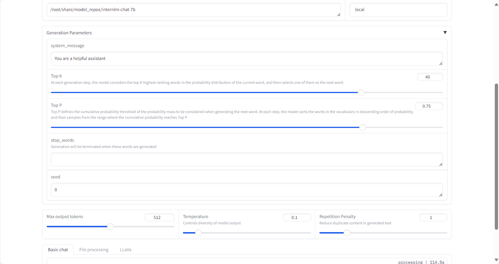
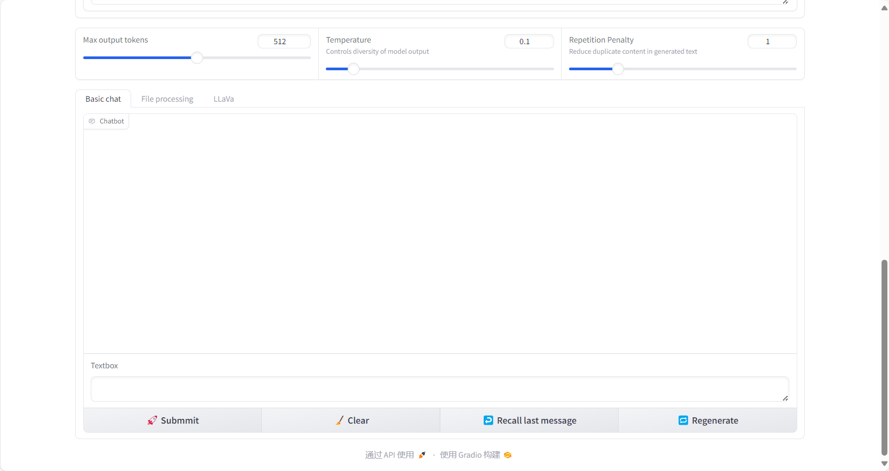
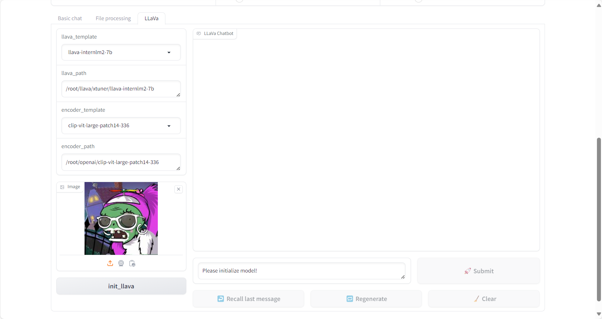

## Chat 使用

在使用 chat 前，需要完成 chatbot 的初始化，这将决定后续交互使用的模型类型以及推理引擎种类

- 首先在 model path 中填入本地模型路径（目前仅支持本地模型）

- 完成后根据模型选择对应对话模板

- 选择推理引擎种类（支持 Huggingface，LMDeploy，Vllm，Openai 等推理引擎）

- 点击 init_chatbot 按钮，启动 chatbot 初始化

初始化完成后，可以通过滑块调整 Max output tokens Temperature Repetition Penalty 等参数数值，同时支持通过 Generation Pa
rameters 修改更多参数

初始化完成后，将启动 chat 界面，支持撤回消息，重新生成，清空历史（重置bot记忆）等多种操作

## 文件处理
在使用 文件处理 前，同样需要完成 chatbot 的初始化

- 首先在 model path 中填入本地模型路径（目前仅支持本地模型）

- 完成后根据模型选择对应对话模板

- 选择推理引擎种类（支持 Huggingface，LMDeploy，Vllm，Openai 等推理引擎）

- 点击 init_chatbot 按钮，启动 chatbot 初始化

初始化完成后，可以通过滑块调整 Max output tokens Temperature Repetition Penalty 等参数数值，同时支持通过 Generation Pa
rameters 修改更多参数

点击文件上传按钮，将按行读取文件内容并按行生成回复，用户可以在文本框中预览上传消息与生成回答，同时支持用户直接从网页下载文件

## llava chat
在使用 llava chat 前，同样需要完成 llava chatbot 的初始化

- 首先在 model path 中填入本地模型路径（目前仅支持本地模型）

- 在llava相关配置模型路径中填入本地配置模型路径

- 上传图片

- 点击 init_llava 按钮，初始化 llava chat

初始化完成后，可以通过滑块调整 Max output tokens Temperature Repetition Penalty 等参数数值，同时支持通过 Generation Pa
rameters 修改更多参数

支持chat中的多种操作
